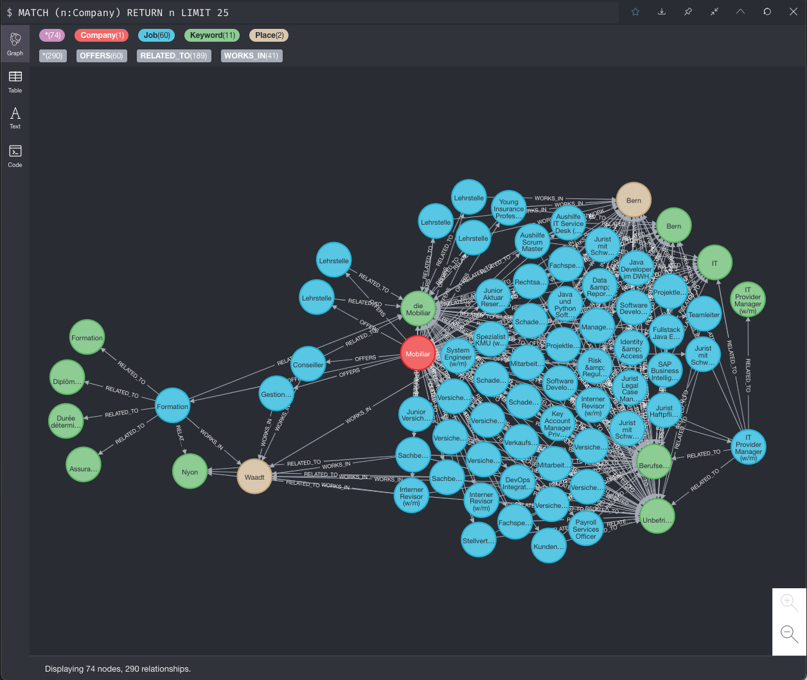

# Jobfinder
Create a graph out of the job offers from Mobiliar.

## Data
Data-Source: https://jobs.mobiliar.ch/Jobs/All

## Neo4j graph database
UI: http://localhost:7474/

    docker-compose start neo4j

## Build

    mvn clean install
    mvn spring-boot:run

## Result

